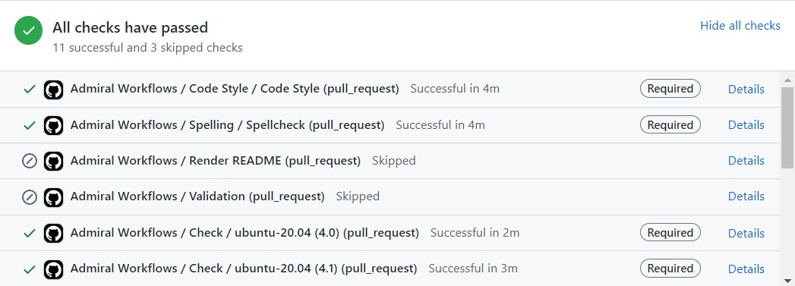
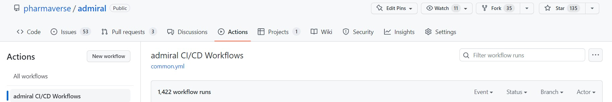

# admiralci

admiral CI/CD workflows

## Purpose

This repository contains GitHub Actions continuous
integration/continuous delivery (CI/CD) workflows, most of which are
used by [`admiral`](https://github.com/pharmaverse/admiral) and its
extensions. Workflows defined here are responsible for assuring high
package quality standards without compromising performance, security, or
reproducibility.

Please refer to the
[`.github/workflows`](https://github.com/pharmaverse/admiralci/blob/main/.github/workflows)
directory to view the source code for the GitHub Actions workflows.

Notes :

- Some workflows are using github actions from
  [InsightsEngineering](https://github.com/insightsengineering/) group.
- Most of the workflows are sharing the same steps (see [Common
  workflows
  structure](https://pharmaverse.github.io/admiralci/articles/common_structure.html))

# Available workflows

The following workflows are available in this repository, and can be
reused in your repository. Please note that it depends on the set up of
your repository when they are triggered.

## Workflows to be triggered by MR (feature branch to main branch)

### Check Templates

- [workflow code (YAML
  file)](https://github.com/pharmaverse/admiralci/blob/main/.github/workflows/check-templates.yml)
- [documentation](https://pharmaverse.github.io/admiralci/articles/check-templates.html)

### Linting

- [workflow code (YAML
  file)](https://github.com/pharmaverse/admiralci/blob/main/.github/workflows/lintr.yml)
- [documentation](https://pharmaverse.github.io/admiralci/articles/lintr.html)

### Man Pages

- [workflow code (YAML
  file)](https://github.com/pharmaverse/admiralci/blob/main/.github/workflows/man-pages.yml)
- [documentation](https://pharmaverse.github.io/admiralci/articles/man-pages.html)

### R CMD CHECKS

- [workflow code (YAML
  file)](https://github.com/pharmaverse/admiralci/blob/main/.github/workflows/r-cmd-check.yml)
- [documentation](https://pharmaverse.github.io/admiralci/articles/r-cmd-checks.html)

### Check Spelling

- [workflow code (YAML
  file)](https://github.com/pharmaverse/admiralci/blob/main/.github/workflows/spellchecks.yml)
- [documentation](https://pharmaverse.github.io/admiralci/articles/spellchecks.html)

### Code Coverage

- [workflow code (YAML
  file)](https://github.com/pharmaverse/admiralci/blob/main/.github/workflows/code-coverage.yml)
- [documentation](https://pharmaverse.github.io/admiralci/articles/code-coverage.html)

### `README` Render

- [workflow code (YAML
  file)](https://github.com/pharmaverse/admiralci/blob/main/.github/workflows/readme-render.yml)
- [documentation](https://pharmaverse.github.io/admiralci/articles/readme-render.html)

### Style

- [workflow code (YAML
  file)](https://github.com/pharmaverse/admiralci/blob/main/.github/workflows/style.yml)
- [documentation](https://pharmaverse.github.io/admiralci/articles/style.html)

## Workflows to be triggered by a new release

### Validation

- [workflow code (YAML
  file)](https://github.com/pharmaverse/admiralci/blob/main/.github/workflows/r-pkg-validation.yml)
- [documentation](https://pharmaverse.github.io/admiralci/articles/validation.html)

### Pkgdown

- [workflow code (YAML
  file)](https://github.com/pharmaverse/admiralci/blob/main/.github/workflows/pkgdown.yml)
- [documentation](https://pharmaverse.github.io/admiralci/articles/pkgdown.html)

## `cron` Workflows

### CRAN Status

- [workflow code (YAML
  file)](https://github.com/pharmaverse/admiralci/blob/main/.github/workflows/cran-status.yml)
- [documentation](https://pharmaverse.github.io/admiralci/articles/cran-status.html)

# How to use these workflows?

## Reuse (recommended)

You could add just *one* file called `.github/workflows/common.yml` to
directly import these workflows while receiving the latest updates and
enhancements, given that the workflows defined in this repository are
reusable via the
[`workflow_call`](https://docs.github.com/en/actions/using-workflows/reusing-workflows#calling-a-reusable-workflow)
GitHub Actions event.

The contents of the `.github/workflows/common.yml` file are available in
the
[`common.yml.inactive`](https://github.com/pharmaverse/admiralci/blob/main/.github/workflows/common.yml.inactive)
file in this repository. It can be customized by modifying the global
variables (look for the `env:` key) or inputs of the called workflows
(look for the `with:` keys) in the file.

To modify when the workflows are triggered, you can modify the `if:`
key.

## Copy as-is (not recommended)

Alternatively, if you want a high level of customization, you could
simply copy the workflows as-is from this repository to your repository
and modify them to your liking. We do not recommend this approach. For
example, you might miss some updated or even bugs fixes from `admiralci`
workflows. If you need some updates in some existing workflows, please
[raise an issue](https://github.com/pharmaverse/admiralci/issues).

## Where to see these workflows in action?

### Pull Request

At the bottom of a pull request, you can check on the status of each
workflow: 

### Actions Tab

Alternatively, you can check on the workflows on the Actions tab in the
repository as well: 

Most of our workflows are using Github Marketplace actions, referenced
bellow :

- [r-lib-actions](https://github.com/r-lib/actions)
- [InsightsEngineering](https://github.com/insightsengineering)
- [lychee](https://github.com/lycheeverse/lychee)
- [`covr`](https://covr.r-lib.org/)
- [`lintr`](https://lintr.r-lib.org/)
- [`pkgdown`](https://pkgdown.r-lib.org/)
- [multi-version-docs](https://github.com/marketplace/actions/r-pkgdown-multi-version-docs)
- [validation](https://github.com/marketplace/actions/r-package-validation-report)
- [spelling](https://docs.ropensci.org/spelling/)
- [`styler`](https://styler.r-lib.org/)
- [workflow_call](https://docs.github.com/en/actions/using-workflows/reusing-workflows)
- [r-lib-actions](https://github.com/r-lib/actions)
- [InsightsEngineering](https://github.com/insightsengineering)
- [lychee](https://github.com/lycheeverse/lychee)
- [`covr`](https://covr.r-lib.org/)
- [`lintr`](https://lintr.r-lib.org/)
- [`pkgdown`](https://pkgdown.r-lib.org/)
- [multi-version-docs](https://github.com/marketplace/actions/r-pkgdown-multi-version-docs)
- [validation](https://github.com/marketplace/actions/r-package-validation-report)
- [spelling](https://docs.ropensci.org/spelling/)
- [`styler`](https://styler.r-lib.org/)
- [workflow_call](https://docs.github.com/en/actions/using-workflows/reusing-workflows)
