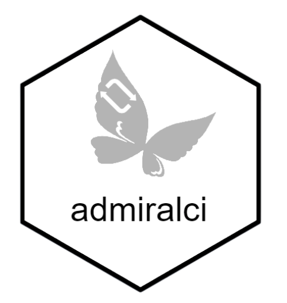
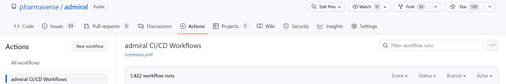

<!-- Please do not edit the README.md file as it is auto-generated. Only edit the README.Rmd file -->

```{r setup, include=FALSE}
knitr::opts_chunk$set(echo = TRUE)
link <- function(text, url) {
  return(
    paste0(
      "[", text, "]",
      "(", url, ")"
    )
  )
}
dyn_link <- function(text,
                     base_url,
                     relative_url = "",
                     # Change to TRUE when admiral adopts multiversion docs
                     is_multiversion = FALSE,
                     multiversion_default_ref = "main") {
  url <- paste(base_url, relative_url, sep = "/")
  if (is_multiversion) {
    url <- paste(
      base_url,
      Sys.getenv("BRANCH_NAME", multiversion_default_ref),
      relative_url,
      sep = "/"
    )
  }
  return(link(text, url))
}
# Other variables
admiralci_homepage <- "https://pharmaverse.github.io/admiralci"
```

# Purpose of admiralci

{width=60% height=60%}

This repository contains GitHub Actions continuous integration/continuous delivery (CI/CD) workflows, most of which are used by [`admiral`](https://github.com/pharmaverse/admiral) and its extensions.
Workflows defined here are responsible for assuring high package quality standards without compromising performance, security, or reproducibility.

Please refer to the [`.github/workflows`](.github/workflows) directory to view the source code for the GitHub Actions workflows.

Notes :

- Some workflows are using github actions from [InsightsEngineering](https://github.com/insightsengineering/) group.
<!-- - Most of the workflows tends to be use by other packages (`oak` package for example). A global repository at Pharmaverse organization level will be set-up to host all common workflows for pharmaverse packages (Beyond Admiral uses cases).
This package will then probably be replaced by this global Pharmaverse repository in the future. -->
- Most of the workflows are sharing the same steps (see [Common workflows structure](https://pharmaverse.github.io/admiralci/common_structure.html)) (boilerplate code)


# Available workflows

## Workflows triggered by Admiral MR (feature branch to main branch)

### Check Templates


- [Link to workflow code (yml file)](https://github.com/pharmaverse/admiralci/blob/main/.github/workflows/check-templates.yml)
- [Link to the documentation](`r paste0(admiralci_homepage, "/articles/check-templates.html")`)

### Lintr

- [Link to workflow code (yml file)](https://github.com/pharmaverse/admiralci/blob/main/.github/workflows/lintr.yml)
- [Link to the documentation](`r paste0(admiralci_homepage, "/articles/lintr.html")`)

### Man Pages

- [Link to workflow code (yml file)](https://github.com/pharmaverse/admiralci/blob/main/.github/workflows/man-pages.yml)
- [Link to the documentation](`r paste0(admiralci_homepage, "/articles/man-pages.html")`)

### R CMD CHECKS

- [Link to workflow code (yml file)](https://github.com/pharmaverse/admiralci/blob/main/.github/workflows/r-cmd-check.yml)
- [Link to the documentation](`r paste0(admiralci_homepage, "/articles/r-cmd-checks.html")`)

### Check Templates

- [Link to workflow code (yml file)](https://github.com/pharmaverse/admiralci/blob/main/.github/workflows/spellchecks.yml)
- [Link to the documentation](`r paste0(admiralci_homepage, "/articles/spellchecks.html")`)

### Code Coverage

- [Link to workflow code (yml file)](https://github.com/pharmaverse/admiralci/blob/main/.github/workflows/code-coverage.yml)
- [Link to the documentation](`r paste0(admiralci_homepage, "/articles/code-coverage.html")`)

### Readme Render

- [Link to workflow code (yml file)](https://github.com/pharmaverse/admiralci/blob/main/.github/workflows/readme-render.yml)
- [Link to the documentation](`r paste0(admiralci_homepage, "/articles/readme-render.html")`)

### Style

- [Link to workflow code (yml file)](https://github.com/pharmaverse/admiralci/blob/main/.github/workflows/style.yml)
- [Link to the documentation](`r paste0(admiralci_homepage, "/articles/style.html")`)

## Workflows trigger by a new release

### Validation

- [Link to workflow code (yml file)](https://github.com/pharmaverse/admiralci/blob/main/.github/workflows/r-pkg-validation.yml)
- [Link to the documentation](`r paste0(admiralci_homepage, "/articles/validation.html")`)

### Pkgdown

- [Link to workflow code (yml file)](https://github.com/pharmaverse/admiralci/blob/main/.github/workflows/pkgdown.yml)
- [Link to the documentation](`r paste0(admiralci_homepage, "/articles/pkgdown.html")`)

## cron workflows

### Push Docker Image

- [Link to workflow code (yml file)](https://github.com/pharmaverse/admiralci/blob/main/.github/workflows/push-docker-image.yml)
- [Link to the documentation](`r paste0(admiralci_homepage, "/articles/push-docker.html")`)

### Cran Status

- [Link to workflow code (yml file)](https://github.com/pharmaverse/admiralci/blob/main/.github/workflows/cran-status.yml)
- [Link to the documentation](`r paste0(admiralci_homepage, "/articles/cran-status.html")`)

### Check R Tags

- [Link to workflow code (yml file)](https://github.com/pharmaverse/admiralci/blob/main/.github/workflows/check-r-tags.yml)
- [Link to the documentation](`r paste0(admiralci_homepage, "/articles/check-r-tags.html")`)


# How to use these workflows?

## Reuse (recommended)

You could add just _one_ file called `.github/workflows/common.yml` to directly import these workflows while receiving the latest updates and enhancements, given that the workflows defined in this repository are reusable via the [`workflow_call`][workflow_call] GitHub Actions event.

The contents of the `.github/workflows/common.yml` file are available in the [`common.yml.inactive`](https://github.com/pharmaverse/admiralci/blob/main/.github/workflows/common.yml.inactive) file in this repository. Feature flags in the form of `workflow_call` inputs are available for customization purposes. Feature flags are documented in the same file - look for the `env:` and `with:` hashes in the file for feature flags.

<!-- TODO: update common.inactive taking the one from admiral because it's quite outdated ..  -->
## Copy as-is (not recommended)

Alternatively, if you want a high level of customization, you could simply copy the workflows as-is from this repository to your repository and modify them to your liking.
We do not recommand this approach. For example, you might miss some updated or even bugs fixes from `admiralci` workflows. If you need some updates in some existing workflows, please [raise an issue](https://github.com/pharmaverse/admiralci/issues).

## Where to see these workflows in action?

### Pull Request

At the bottom of a pull request, you can check on the status of each workflow:


### Actions Tab
Alternatively, you can check on the workflows on the Actions tab in the repository as well:



Most of our workflows are using Github Marketplace actions, referenced bellow :

- [InsightsEngineering](https://github.com/insightsengineering)
- [r-lib-actions](https://github.com/r-lib/actions)
- [sd-action](https://github.com/marketplace/actions/staged-dependencies-action)
- [sd-repo](https://github.com/openpharma/staged.dependencies)
- [lychee](https://github.com/lycheeverse/lychee)
- [covr](https://covr.r-lib.org/)
- [lintr](https://lintr.r-lib.org/)
- [pkgdown](https://pkgdown.r-lib.org/)
- [multi-version-docs](https://github.com/marketplace/actions/r-pkgdown-multi-version-docs)
- [validation](https://github.com/marketplace/actions/r-package-validation-report)
- [spelling](https://docs.ropensci.org/spelling/)
- [styler](https://styler.r-lib.org/)
- [workflow_call](https://docs.github.com/en/actions/using-workflows/reusing-workflows)